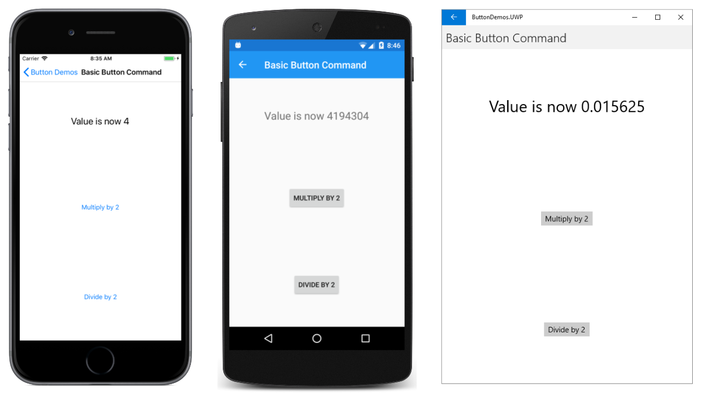

# Button Demos

This program demonstrates the Xamarin.Forms `Button` properties and events instrumented with Dynatrace.

## How to run this repo

Clone the repo and update the file ```dynatrace.config.json``` to the version to your tenant. Please pay attention that the file you download from the tenant has user Opt-In set to true, which means that the user has to agree to be monitored. While this is the recommended (and sometimes mandatory) way for production, for testing purposes it just makes things more complicated. So in order to run this demo you also have to set user Opt-In to false on the file. Your file must look something like this:

```
{
	"android": {
		"autoStart": {
			"beaconUrl": "https://<your_url>.bf.dynatrace.com/mbeacon",
			"applicationId": "<your application id>"
		},
		"userOptIn": false,
		"agentBehavior": {
			"startupLoadBalancing":  true
		}
	},
	"ios": {
		"DTXApplicationId": "<your application id>",
		"DTXBeaconUrl": "https://<your_url>.bf.dynatrace.com/mbeacon",
		"DTXUserOptIn": false,
		"DTXStartupLoadBalancing": true
	}
}
```

## Important

Please make sure that the Nuget package is installed on the root solution and also on the Android and iOS projects. If it is just on the root solution, instrumentation will not work.

This application will register a session with user name "John Doe", to create different users go ahead and change the application code to your needs.

This is based on a Demop app from Microsoft that with some minor changes to demonstrate the instrumentation, original repo has more examples and can be found here: [https://github.com/xamarin/xamarin-forms-samples.git](https://github.com/xamarin/xamarin-forms-samples.git)



